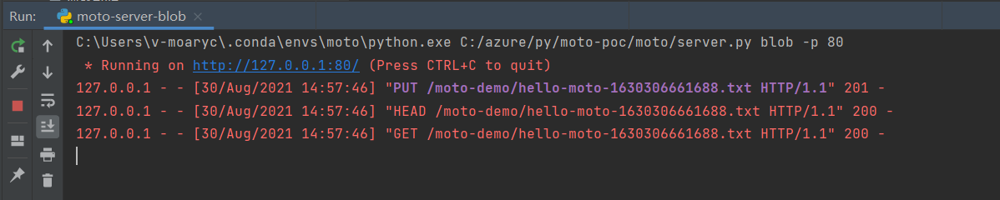

# Azure Storage Blob SDK  Demo

## Features
This demo project only provides storage blob `save` and `get` interfaces, the implementation wraps the `upload` and `downloadStream` APIs of Azure Storage Blob SDK to process the string value from Azure Storage Blob.

```java
public interface StorageBlobService<T> {
    boolean save(T context) throws IOException;
    T get() throws IOException;
}
```

The class `StorageBlobServiceImplTest` will use the `{blob_profile}.properties` file to apply the storage blob credential, it covers the two methods from interface `StorageBlobService`.
The default value of the environment variable `blob_profile` is `moto`.
## Goals

This project will use the unit testcases to demonstrate with the [Azure Moto](https://github.com/moarychan/moto/tree/azure-storage-blob-poc) server, which is easier and faster to respond to the request based on Azure Storage Blob Service. 

## Getting started

### Prerequisites
1. Python SDK(3.8)
2. Java SDK(1.8)
3. Git
4. Maven

### Clone code

1. Clone storage-blob-sdk-demo project.
2. Clone the [Azure Moto POC](https://github.com/moarychan/moto/tree/azure-storage-blob-poc) code.

### Running with the local moto profile
There's a default *moto.properties* file to apply the local usage.

For moto server side, enter the `moto` directory from the command line, 
run the following command to start the Azure Moto server:

Run the server.py module:


Run the maven command:
```shell
mvn clean test
```

Similar output:
```text
--> PUT http://localhost/moto-demo/hello-moto-1630306661688.txtTry count: 2Date:Mon, 30 Aug 2021 06:57:43 GMTAuthorization:REDACTEDContent-Length:11If-None-Match:*x-ms-version:REDACTEDContent-Type:application/octet-streamx-ms-client-request-id:ff327837-f25e-472e-822a-432620b2568ex-ms-blob-type:REDACTEDAccept:application/xmlUser-Agent:azsdk-java-azure-storage-blob/12.13.0 (1.8.0_291; Windows 10; 10.0)11-byte body: (content not logged)--> END PUT
<-- 201 http://localhost/moto-demo/hello-moto-1630306661688.txt (1777 ms, 7-byte body)last-modified:Mon, 30 Aug 2021 06:57:46 GMTContent-MD5:REDACTEDx-ms-request-server-encrypted:REDACTEDx-ms-client-request-id:ff327837-f25e-472e-822a-432620b2568ex-ms-encryption-scope:REDACTEDx-ms-version-id:REDACTEDContent-Type:text/html; charset=utf-8Access-Control-Allow-Origin:REDACTEDServer:Werkzeug/2.0.1 Python/3.8.11Date:Mon, 30 Aug 2021 06:57:46 GMTcontent-length:7eTag:0x8D968986D69CE76Response body:Created<-- END HTTP
--> HEAD http://localhost/moto-demo/hello-moto-1630306661688.txtTry count: 2Date:Mon, 30 Aug 2021 06:57:46 GMTAuthorization:REDACTEDContent-Length:0x-ms-version:REDACTEDx-ms-client-request-id:a1ae667c-aa18-4ab0-b863-41e26d6c54a2Accept:application/xmlUser-Agent:azsdk-java-azure-storage-blob/12.13.0 (1.8.0_291; Windows 10; 10.0)(empty body)--> END HEAD
<-- 200 http://localhost/moto-demo/hello-moto-1630306661688.txt (11 ms, 0-byte body)Content-Type:text/html; charset=utf-8Access-Control-Allow-Origin:REDACTEDServer:Werkzeug/2.0.1 Python/3.8.11Date:Mon, 30 Aug 2021 06:57:46 GMTcontent-length:0(body content not logged)<-- END HTTP
--> GET http://localhost/moto-demo/hello-moto-1630306661688.txtTry count: 2Date:Mon, 30 Aug 2021 06:57:46 GMTAuthorization:REDACTEDContent-Length:0x-ms-version:REDACTEDx-ms-client-request-id:80059990-de7c-4b9e-9cfe-456cc0b342b0Accept:application/xmlUser-Agent:azsdk-java-azure-storage-blob/12.13.0 (1.8.0_291; Windows 10; 10.0)(empty body)--> END GET
<-- 200 http://localhost/moto-demo/hello-moto-1630306661688.txt (8 ms, 11-byte body)Content-Type:text/html; charset=utf-8Access-Control-Allow-Origin:REDACTEDServer:Werkzeug/2.0.1 Python/3.8.11Date:Mon, 30 Aug 2021 06:57:46 GMTcontent-length:11Response body:HelloWorld!<-- END HTTP
```

Similar output in moto server console:


### Running with the public cloud profile

Prepare the Azure storage credentials and create a test container manually.

- Fill in the configuration file *azure.properties*:
```properties
storage-endpoint=[your-blob-service-endpoint]
storage-account-name=[your-storage-account-name]
storage-account-key=[your-storage-key]
storage-container-name=[your-demo-container-name]
storage-file-name-prefix=[your-demo-blob-file-prefix]
```

Run the maven command:
```shell
mvn clean test
```

- Set the environment variables to fill the properties.

```shell
mvn clean test -Dblob_profile=azure -Dstorage-endpoint=https://xxx.blob.core.windows.net -Dstorage-account-name=xxx -Dstorage-account-key=xxx -Dstorage-container-name=xxx -Dstorage-file-name-prefix=xxx
```

Similar output:
```text
--> PUT https://xxx.blob.core.windows.net/azure-demo/null-1630304920049.txtTry count: 2Date:Mon, 30 Aug 2021 06:28:42 GMTAuthorization:REDACTEDContent-Length:11If-None-Match:*x-ms-version:REDACTEDContent-Type:application/octet-streamx-ms-client-request-id:585e1b54-6f72-4704-a2cb-7266292e4644x-ms-blob-type:REDACTEDAccept:application/xmlUser-Agent:azsdk-java-azure-storage-blob/12.13.0 (11.0.11; Windows 10; 10.0)11-byte body: (content not logged)--> END PUT
<-- 201 https://xxx.blob.core.windows.net/azure-demo/null-1630304920049.txt (3116 ms, 0-byte body)Content-MD5:REDACTEDLast-Modified:Mon, 30 Aug 2021 06:28:44 GMTServer:Windows-Azure-Blob/1.0 Microsoft-HTTPAPI/2.0x-ms-request-id:REDACTEDx-ms-client-request-id:585e1b54-6f72-4704-a2cb-7266292e4644x-ms-version:REDACTEDx-ms-content-crc64:REDACTEDx-ms-request-server-encrypted:REDACTEDDate:Mon, 30 Aug 2021 06:28:44 GMTcontent-length:0eTag:0x8D96B7F6AE2E7C8(body content not logged)<-- END HTTP
--> HEAD https://xxx.blob.core.windows.net/azure-demo/null-1630304920049.txtTry count: 2Date:Mon, 30 Aug 2021 06:28:45 GMTAuthorization:REDACTEDContent-Length:0x-ms-version:REDACTEDx-ms-client-request-id:07f2ac9d-3de2-4e3f-8570-f2cf105810b2Accept:application/xmlUser-Agent:azsdk-java-azure-storage-blob/12.13.0 (11.0.11; Windows 10; 10.0)(empty body)--> END HEAD
<-- 200 https://xxx.blob.core.windows.net/azure-demo/null-1630304920049.txt (260 ms, 11-byte body)Content-Type:application/octet-streamContent-MD5:REDACTEDLast-Modified:Mon, 30 Aug 2021 06:28:44 GMTAccept-Ranges:REDACTEDServer:Windows-Azure-Blob/1.0 Microsoft-HTTPAPI/2.0x-ms-request-id:REDACTEDx-ms-client-request-id:07f2ac9d-3de2-4e3f-8570-f2cf105810b2x-ms-version:REDACTEDx-ms-creation-time:REDACTEDx-ms-lease-status:REDACTEDx-ms-lease-state:REDACTEDx-ms-blob-type:REDACTEDx-ms-server-encrypted:REDACTEDx-ms-access-tier:REDACTEDx-ms-access-tier-inferred:REDACTEDDate:Mon, 30 Aug 2021 06:28:45 GMTcontent-length:11eTag:0x8D96B7F6AE2E7C8(body content not logged)<-- END HTTP
--> GET https://xxx.blob.core.windows.net/azure-demo/null-1630304920049.txtTry count: 2Date:Mon, 30 Aug 2021 06:28:45 GMTAuthorization:REDACTEDContent-Length:0x-ms-version:REDACTEDx-ms-client-request-id:484606a5-e0b8-4308-a6e1-decaf6a864f1Accept:application/xmlUser-Agent:azsdk-java-azure-storage-blob/12.13.0 (11.0.11; Windows 10; 10.0)(empty body)--> END GET
<-- 200 https://xxx.blob.core.windows.net/azure-demo/null-1630304920049.txt (268 ms, 11-byte body)Content-Type:application/octet-streamContent-MD5:REDACTEDLast-Modified:Mon, 30 Aug 2021 06:28:44 GMTAccept-Ranges:REDACTEDServer:Windows-Azure-Blob/1.0 Microsoft-HTTPAPI/2.0x-ms-request-id:REDACTEDx-ms-client-request-id:484606a5-e0b8-4308-a6e1-decaf6a864f1x-ms-version:REDACTEDx-ms-creation-time:REDACTEDx-ms-lease-status:REDACTEDx-ms-lease-state:REDACTEDx-ms-blob-type:REDACTEDx-ms-server-encrypted:REDACTEDDate:Mon, 30 Aug 2021 06:28:45 GMTcontent-length:11eTag:0x8D96B7F6AE2E7C8(body content not logged)<-- END HTTP
```
